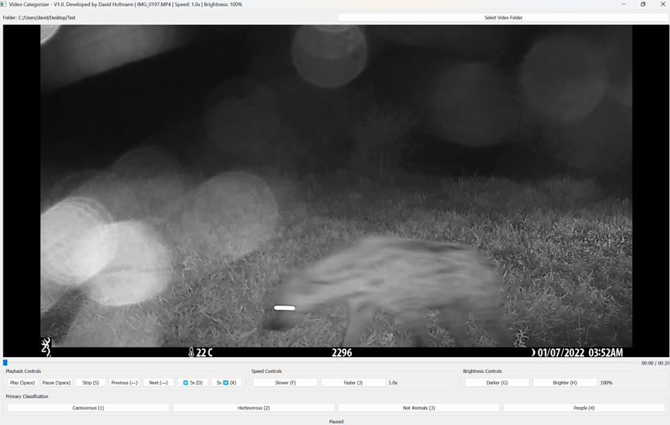

# Video Categorizer

A specialized tool for organizing wildlife video footage into categories and subcategories, with particular focus on carnivorous species identification. The application provides keyboard shortcuts for efficient playback control and video classification.

## Table of Contents
- [Overview](#overview)
- [Installation](#installation)
- [Basic Operation](#basic-operation)
- [Playback Controls](#playback-controls)
- [Categorization Controls](#categorization-controls)
- [Workflow Recommendation](#workflow-recommendation)

## Overview
The Video Categorizer is designed to streamline the process of reviewing and organizing wildlife footage. Key features include:
- Keyboard shortcuts for efficient operation
- Two-level categorization system
- Automatic file organization
- Playback controls (speed, brightness, navigation)

## Installation
1. Ensure you have [VLC](https://www.videolan.org/vlc/index.html) installed
2. Download the [VideoCategorizer.exe](https://github.com/DavidDHofmann/video_categorizer/blob/main/dist/VideoCategorizer.exe)
3. Place the executable in your preferred location
4. *(Optional)* Create a desktop shortcut for easy access

## Basic Operation
### Loading Videos
1. Launch the application (double-click VideoCategorizer.exe)
2. Click "Select Video Folder" and choose your video directory
3. Supported formats: MP4, MOV, AVI, MKV

## Playback Controls

| Key       | Function               |
|-----------|------------------------|
| Space     | Play/Pause             |
| S         | Stop/Skip              |
| ←         | Previous video         |
| →         | Next video             |
| D         | Jump back 5 seconds    |
| K         | Jump forward 5 seconds |
| F         | Decrease speed         |
| J         | Increase speed         |
| G         | Decrease brightness    |
| H         | Increase brightness    |

## Categorization Controls

### Primary Categories
1. **1** - Carnivorous (enters submenu)
2. **2** - Herbivorous
3. **3** - Not Animals
4. **4** - People

### Carnivorous Subcategories
| Key | Species         |
|-----|-----------------|
| 1   | Lion            |
| 2   | Leopard         |
| 3   | Wild Dog        |
| 4   | Cheetah         |
| 5   | Spotted Hyaena  |
| 6   | Brown Hyaena    |
| 7   | Fox             |
| 8   | Genet           |
| 9   | Honeybadger     |
| C   | Caracal         |
| J   | Jackal          |
| M   | Mongoose        |
| V   | Civet           |
| X   | Small Cat       |
| Esc | Back to primary |

## Workflow Recommendation
1. Browse to your folder of uncategorized videos
2. Classify using keyboard shortcuts:
   - For carnivorous species: Press **1** then species key
   - For other categories: Press **2-4**
3. The system automatically:
   - Moves file to appropriate folder
   - Advances to next video
4. Repeat until all videos are categorized
